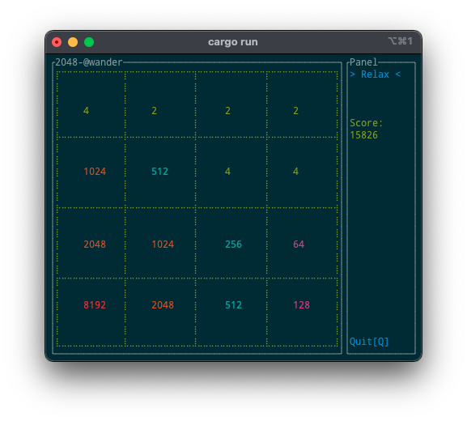
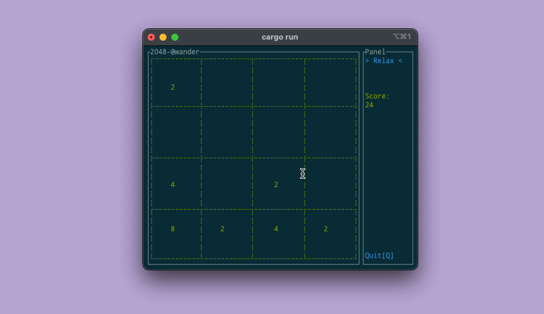

# TUI 2048 - Have a relax at anytime - 😎

^_^

## How to run

### repo

1. clone this repo, `git clone https://github.com/WanderHuang/game-2048-tui.git`
2. `cd game-2048-tui`
3. `cargo run`
4. (option) build binary, `cargo build --release`

## Purpose

I have been learning Rust for some time, I should make an app to check if I have accepted those Rust knowledges. So come out this simple game app.

If you love this repo, thank you for one star or leave an issue to contact me. Let's keep learning together~

## Furthermore

Rust is a good language, hope me get more experienced on it.
## LICENSE

MIT